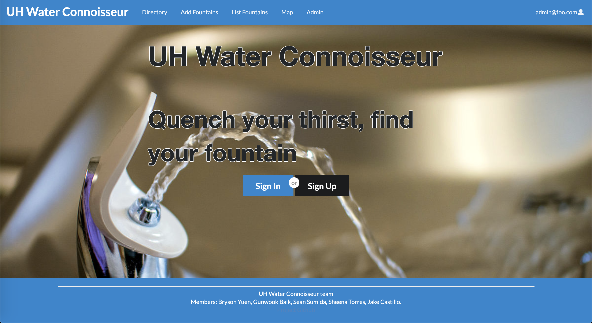
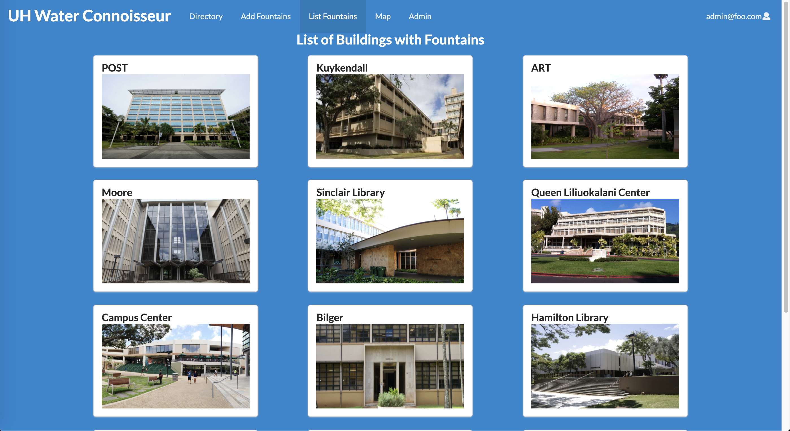
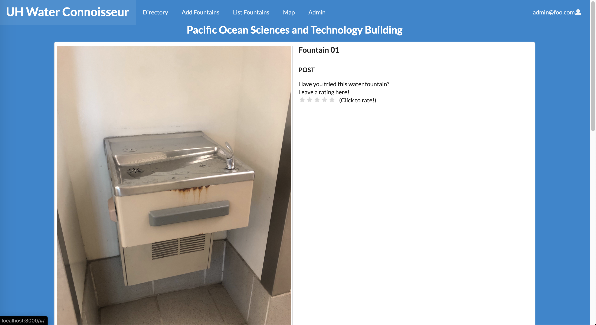
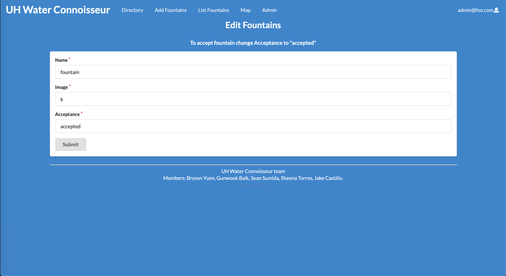

This class project My group and I made an app. In this app there will be a way to organize and present different water fountains around the UH Manoa campus. There will be two roles, Users, who can login to review water fountains and submit requests to have water fountains added to the list of reviewable water fountains. Admins, who will be able to login and moderate the app as well as add water fountains to the reviewable list.

My contribution to the app was the to make the page that dispalyed the buildings, have each building card to link to their respective building page with the fountains to be displayed upon, and I also added the ability to add fountains but only direct it to the admin page to then be accepted which would have that new fountain added to the list of existing fountains.

If you want to check out our project click [here](https://github.com/uh-waterfountain).
